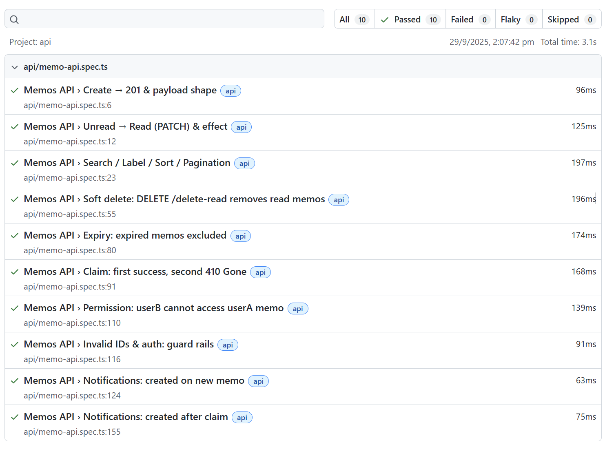

# 📬 Mailbox Feature - Test Report

This document summarizes the Playwright API + UI test coverage and results for the **Memo/Mailbox** feature.

---

## 1. Test Scope

### API Coverage
The following API functionalities were tested:

- **Unread → Read**: Marking a memo as read and verifying the state change.  
- **Search / Label / Sort / Pagination**: Querying with filters and sorting, verifying page size cap.  
- **Soft Delete**: Removing read memos using `DELETE /delete-read`.  
- **Expiry**: Ensuring expired memos are excluded from the list.  
- **Claim**: One-time claimable attachments (first success, second denied).  
- **Notifications**: Generating a notification when a new memo is created.  
- **Permission & Security**: Ensuring only the recipient can access a memo, invalid IDs are rejected.  

### UI Coverage
The following UI scenarios were tested on **memo.html**:

- **Create Memo (Modal Flow)**: Open modal, fill subject/body, submit, and verify new row appears.  
- **Unread Badge Updates**: Creating a memo increases the unread badge count.  
- **Claim Button State**: Claimable attachments update button text to *Claimed* after click.  
- **Empty State**:  
  - Intercepted `GET /api/memos` to return empty → showed *“Your mailbox is empty”*.  
  - Brand-new user with no memos → showed same empty placeholder and correct pager state.  
- **Error Handling**: Forced `500` response → UI displayed *“Failed to load.”* with Retry button.  
- **Loading State**: Delayed response → UI displayed *“Loading...”* placeholder, which disappeared after data loaded.  
- **Cross-Browser Validation**: All scenarios were executed against **Chromium, Firefox, WebKit** with isolated users per project.  

---

## 2. Test Environment

- **Framework:** Playwright  
- **Config:** `playwright.config.ts` with `api` and `ui` projects  
- **Base URL:** `http://localhost:3000`  
- **Database:** MongoDB (local instance)  
- **Auth:** `x-user-id` and headers simulated for `userA`, `userB`, `admin`, plus generated users for empty tests  

---

## 3. Test Results

### API
- ✅ **10 tests executed**  
- ✅ **All passed**  

### UI
- ✅ **18 tests executed (3 scenarios × 3 browsers + edge cases)**  
- ✅ **All passed** 

---

## 4. Sample Report Screenshots

API run:  

UI run:  

*(Make sure `test-results/playwright-report.png` images are committed with this file so they display in GitHub.)*

---

## 5. Defects / Notes

- API: initial mismatches (201 vs 200) corrected by aligning controllers and helpers.  
- UI: required stable selectors (`data-testid`, `#id`) and `waitForResponse` to avoid flakiness.  
- Tested under **3 browsers** to ensure consistent rendering and state management.  

---

## 6. Conclusion

The Mailbox (Memo) **API and UI** are now covered by automated Playwright tests, with **100% pass rate** across all major scenarios.  
This ensures reliability for core mailbox operations (create, update, delete, claim, notify) as well as robust UI behavior under normal, empty, error, and loading states.
